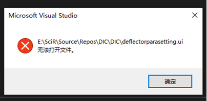
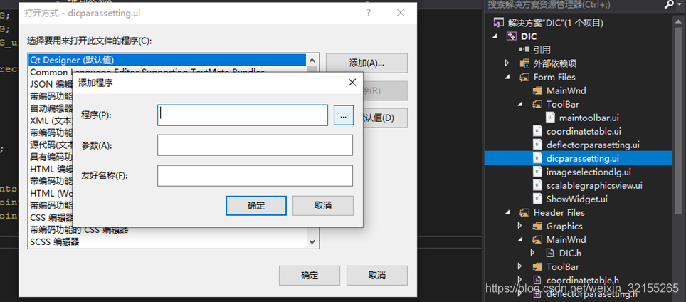
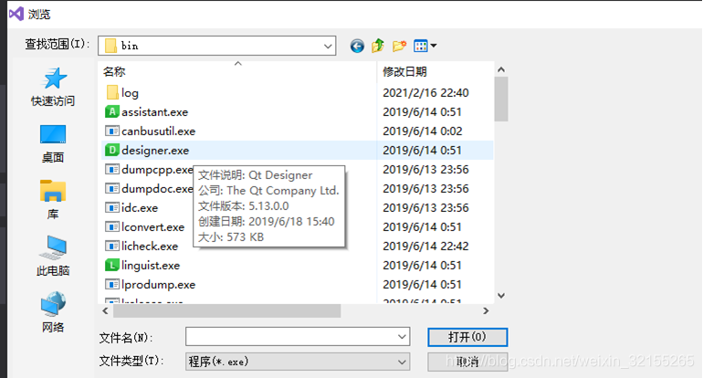
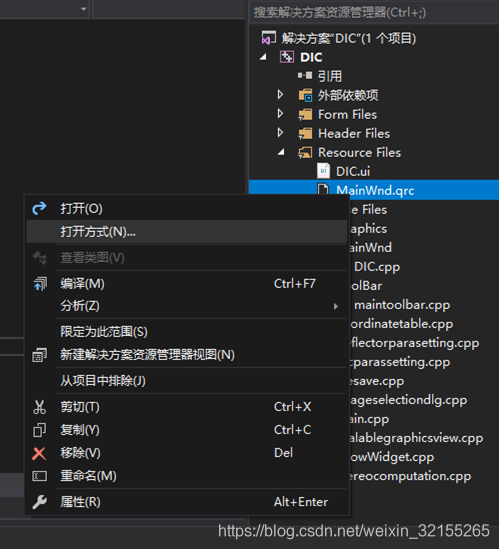
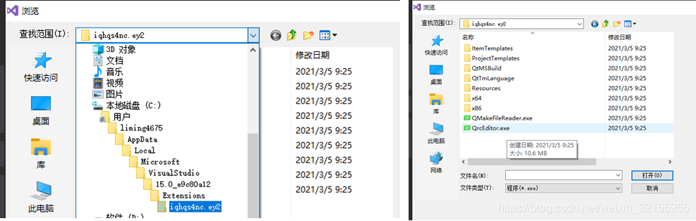
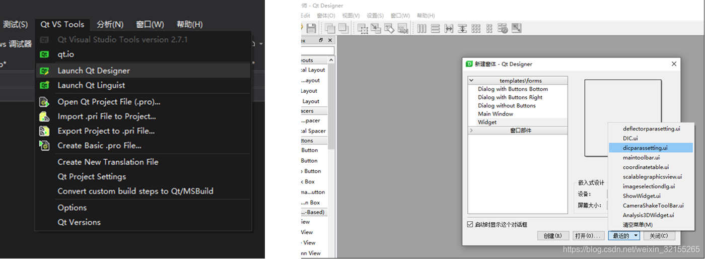

# VS打开Qt的ui界面几秒后闪退（ui无法打开文件）的解决办法

**VS打开Qt的ui界面几秒后闪退（ui无法打开文件）的解决办法**

**问题：**
近两天在vs中直接点解ui界面，自动调用Qt Designer打开界面几秒后Designer界面闪退，回到vs界面，并有“——.ui无法打开文件”的错误提示。
这个问题应该是Windows或Qt哪些东西更新造成的，用Qt的几个同学都有反应这个问题。

**解决方法：**
注：软件版本：VS2017 + Qt5.13.0

**方法一（评论区网友提供，操作比较简单，可以优先一试）：**
选择“扩展->QT VS Tools->Options”，对话框中左侧选择“Qt->General”，右侧选择“Qt Designer->Run in detached window”选项值设为true 即可解决。
**方法二：**
1）ui界面右键，进入“打开方式”，找到Qt安装路径下的designer.exe并点击（例如，我的路径为D:\Qt\5.13.0\msvc2017_64\bin\designer.exe）添加，之后将其设为默认值。

2）在资源文件在找.qrc资源文件，同步骤1），只是添加的是C:\Users\liming4675\AppData\Local\Microsoft\VisualStudio\15.0_e9c80a12\Extensions\iqhqs4nc.ey2\QrcEditor.exe（需要将此路径的liming4675换成自己的电脑用户名）。如果找不到AppData这个文件，请将“隐藏的项目”显示。可能你的电脑没有文件iqhqs4nc.ey2，或这个文件中没有QrcEditor.exe，请在Extensions目录下的几个文件中找QrcEditor.exe。
同样地，找到QrcEditor.exe后，将其添加并设为默认值。

方法三：
另外一种方法是利用菜单栏Qt VS Tools中的Launch Qt Designer打开Designer，然后从最近的ui中选择想要的界面打开即可。

liming4675

关注

————————————————

版权声明：本文为CSDN博主「liming4675」的原创文章，遵循CC 4.0 BY-SA版权协议，转载请附上原文出处链接及本声明。

原文链接：https://blog.csdn.net/weixin_32155265/article/details/114905744