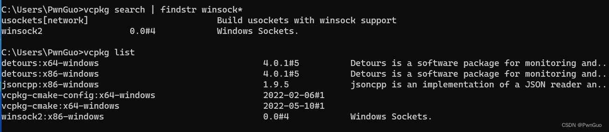
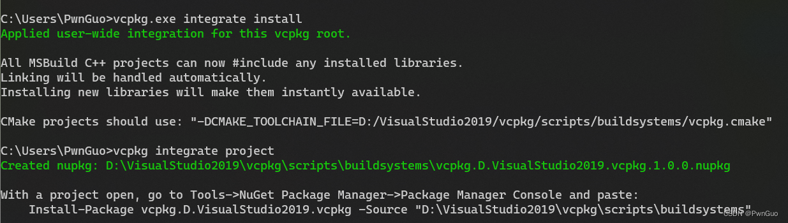
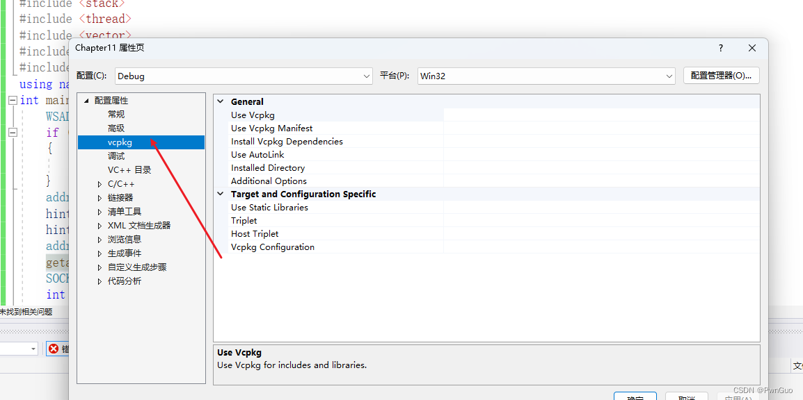
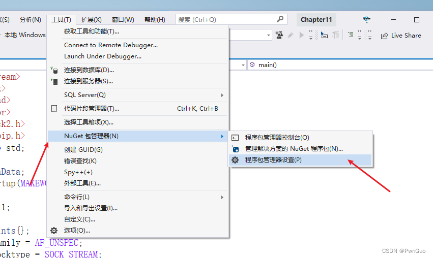
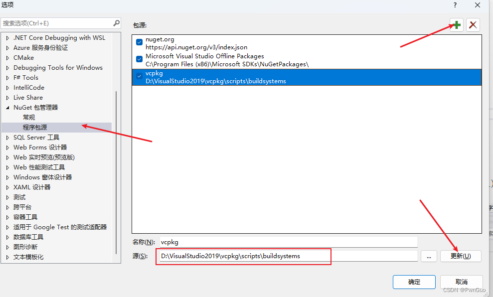
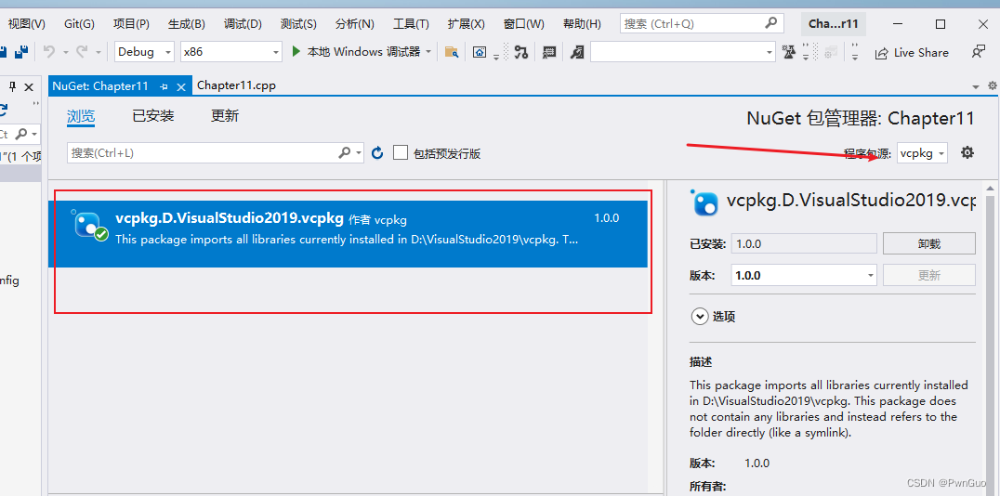

# Visual Studio 2019配置 vcpkg C++包管理工具

## 简介

vcpkg 可帮助您在 Windows、 Linux 和 MacOS 上管理 C 和 C++ 库。 在开发过程中，尤其使用一些第三方库配置过程相当麻烦各种细节导致莫名的报错。，使用 vcpkg+Visual Studio 2019 省去了各种动态静态库等的配置，有效提高工作效率。

## 配置

我们以网络编程中遇到需要包含的 Winsock2 库为例，使用 vcpkg 可以快速配置项目环境。

下载安装 vcpkg,使用git 下载或直接github下载相应的版本安装

下载 ：git clone https://github.com/microsoft/vcpkg
安装：运行 bootstrap-vcpkg.bat即可

通过search 查找我们需要的库

vcpkg install Winsock2 安装我们需要的库 vcpkg 在 Windows 中默认编译并安装x86版本的库。 若要编译并安装x64版本，请执行:

vcpkg install Winsock2:x64-windows  命令安装好我们需要的库后使用 vcpkg list 查看我们当前安装如下图中我们安装的相关库。




Visual Studio 中使用vcpkg

输入命令 vcpkg integrate install（如果在visual studio中未找到可以使用管理员权限）

命令 vcpkg integrate project 是为我们项目所需生成配置



新建vs工程查看属性->配置属性中已经有我们安装的 vcpkg 选项，不需要额外配置任何路径



在工具选项中选择程序员包管理设置对 vcpkg 进行配置



 对NuGet包管理器中添加程序包源，源路径选择我们按照的 vcpkg 目录下scripts\buildsystems 后点击更新完成配置



 我们的 vcpkg 配置基本完成，接下来就是在项目中添加，右键工程 选择管理 NuGet 程序包，程序包源选择我们上面配置的 自定义 vcpkg 名称安装即可。



 到此，Visual Studio 2019 配置vcpkg 基本完成。下面我们测试是否成功。

```
#include <iostream>
#include<WinSock2.h>
#include<WS2tcpip.h>
using namespace std;
int main() {
	WSADATA wsaData;
	if (WSAStartup(MAKEWORD(2,2),&wsaData)!=0)
	{
		return 1;
	}
	addrinfo hints{};
	hints.ai_family = AF_UNSPEC;
	hints.ai_socktype = SOCK_STREAM;
	addrinfo* servinfo{};
	getaddrinfo("www.baidu.com","80",&hints,&servinfo);
	SOCKET sockfd{ socket(servinfo->ai_family,servinfo->ai_socktype,servinfo->ai_protocol) };
	int connectionResult{ connect(sockfd,servinfo->ai_addr,servinfo->ai_addrlen) };
	if (connectionResult == -1)
	{
		cout << "Connection failed!" << endl;
	}
	else
	{
		cout << "connection successful!" << endl;
	}
	
	freeaddrinfo(servinfo);
	WSACleanup();
	return 0;
}
```

包含 Winsock2 头文件发现无报错，运行测试代码正常返回。

————————————————

版权声明：本文为CSDN博主「PwnGuo」的原创文章，遵循CC 4.0 BY-SA版权协议，转载请附上原文出处链接及本声明。

原文链接：https://blog.csdn.net/qq_37431937/article/details/125644503