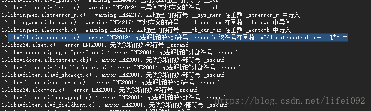

# "error LNK2001: 无法解析的外部符号 _sscanf " 问题 解决方法

**问题场景：**

使用VS2015的软件开发环境中，在引用第三方文件库时，出现了 “libx264.a(ratecontrol.o) : error LNK2019: 无法解析的外部符号 _sscanf，该符号在函数 _x264_ratecontrol_new 中被引用” 等错误，如下图所示：

**原因分析：**

第三方库内使用了printf和scanf等较老的接口，在较新的VS开发环境中已经废弃，所以无法链接到对应的接口，因此解决此问题只需添加printf等函数的接口库即可。

**解决方法：**

在文件头添加 “#pragma comment(lib, "legacy_stdio_definitions.lib")” 即可。

————————————————

版权声明：本文为CSDN博主「lifei092」的原创文章，遵循CC 4.0 BY-SA版权协议，转载请附上原文出处链接及本声明。

原文链接：https://blog.csdn.net/lifei092/article/details/82982154